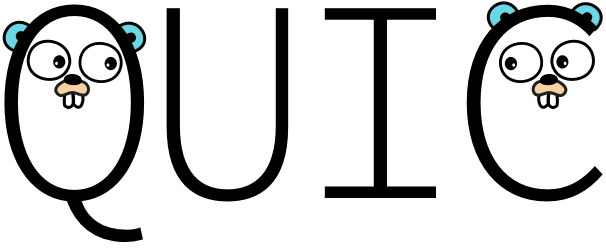

# A QUIC implementation in pure Go

**Please read https://multipath-quic.org/2017/12/09/artifacts-available.html to figure out how to setup the code.**

quic-go is an implementation of the [QUIC](https://en.wikipedia.org/wiki/QUIC) protocol in Go.

## Roadmap

quic-go is compatible with the current version(s) of Google Chrome and QUIC as deployed on Google's servers. We're actively tracking the development of the Chrome code to ensure compatibility as the protocol evolves. In that process, we're dropping support for old QUIC versions.
As Google's QUIC versions are expected to converge towards the [IETF QUIC draft](https://github.com/quicwg/base-drafts), quic-go will eventually implement that draft.

## Guides

We currently support Go 1.9+.

Installing and updating dependencies:

    go get -t -u ./...

Running tests:

    go test ./...

### Running the example server

    go run example/pdd/server/server_v8.0 with 2 clients.go 

Using Chrome:

    http://localhost:6060/dash.js/samples/ppd_dash_player/

